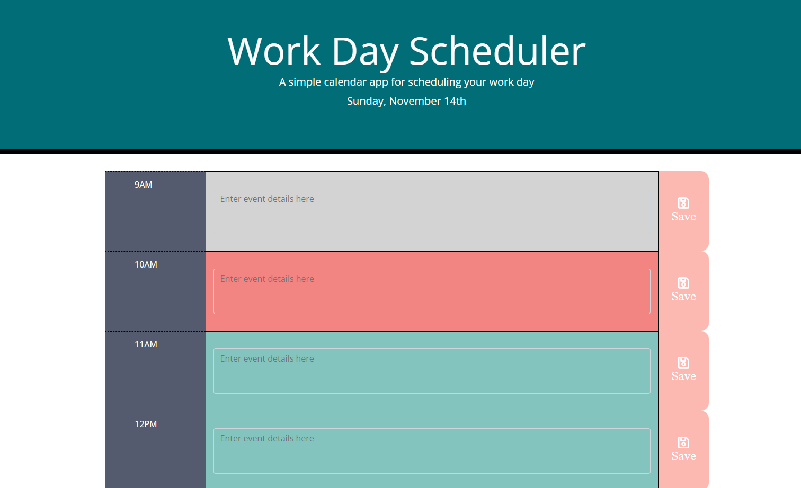

# Day Planner

## Overview

This project was to create a daily planner that displays the current date in the heading and provides editable time blocks for a standard work day, from 9am to 5pm.

The time blocks are color coded so that blocks in the past show as grey, the current time block shows as red and future time blocks show as green.
In addition, text entered into the time blocks is saved to local storage and persists over sessions.

## Screenshot

## Link

[Deployed application](https://ccroberts1.github.io/day-planner/)

## License
MIT

## Contact Info
- Email: caitlin.coy.roberts@gmail.com
- Twitter: https://twitter.com/caitlincroberts
